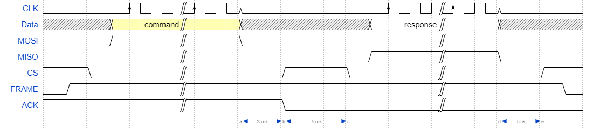

# Pi-Plates-SPI-Protocol-Documentation

The Pi Plates SPI protocol works in one of two ways. The DAQCplate, MOTORplate, and RELAYplate all use predefined timings in order to send commands and get a response. The command is always 4 bytes, with the chip select held during all 4. The response can be any number of bytes, including none at all. The example shown has 1 byte being returned. The chip select would be released and reset between each byte in the response.

The TINKERplate, DAQC2plate, and THERMOplate, on the other hand, all use an ACK pin that is set by the pi plate when it is ready to return information. The raspberry pi waits for this pin to be low before it attempts to get a response. In the example shown, the ACK pin going low is lined up with the CS going high, however, the ACK pin tends to go low before the chip select goes high, and can go low afterwards. The point "b" on the timing section is for the chip select, not the ack bit. Beyond that, the response and command work as listed above.

For all of these examples, the max clock speed is 500000 hz, and the most important timings are listed.
